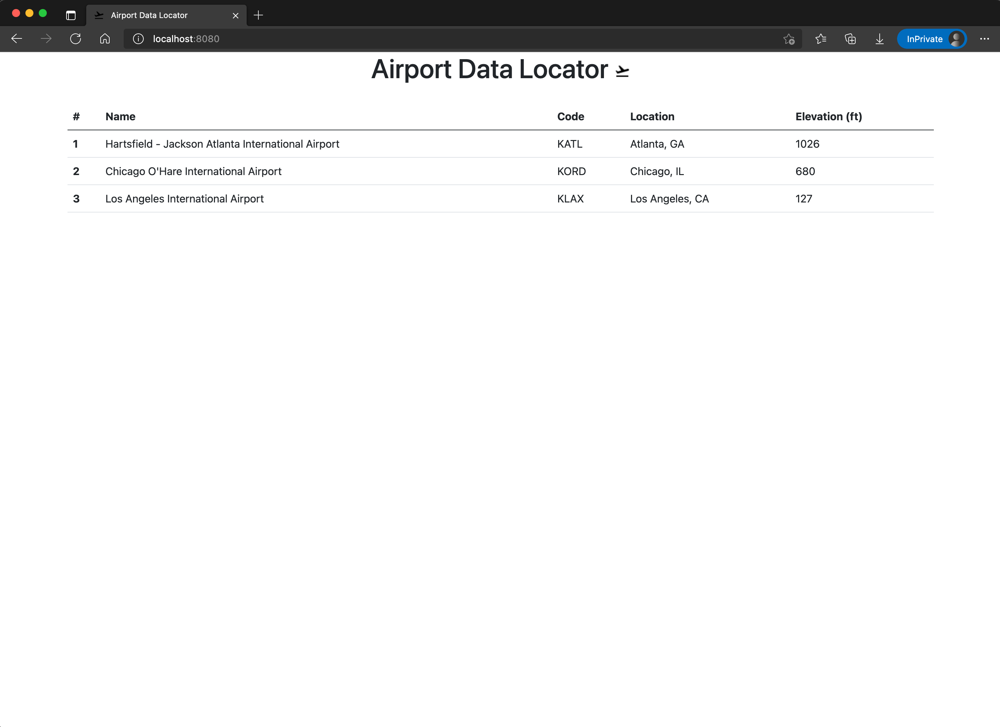

# Airport Data Locator

This is a sample repository to practice building docker containers. Additionally, it can be used to test deployments 
into Kubernetes clusters. It leverages a Java Spring Boot MVC application with a web frontend.

